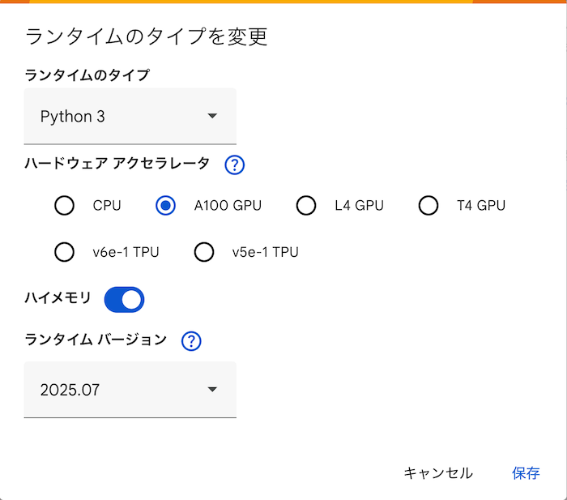

# 直感 生成AI

---


---

本リポジトリはオライリー・ジャパン発行書籍『[直感 生成AI](https://www.amazon.co.jp/dp/481440140X/)』のサポートサイトです。

## 構成

```
.
├── README.md
└── notebooks
    ├── 01_introduction.ipynb    # 1章のコード（ノートブック形式）
    ├── 02_transformers.ipynb    # ...
    ├── 03_compressing.ipynb
    ├── 04_diffusion.ipynb
    ├── 05_stable_diffusion.ipynb
    ├── 06_fine_tuning_language_models.ipynb
    ├── 07_fine_tuning_diffusion.ipynb
    ├── 08_creative_applications_of_t2i.ipynb
    ├── 09_generating_audio.ipynb
    └── 13_rag.ipynb             # 付録Cのコード（ノートブック形式）
```

サンプルコードの解説は本書籍をご覧ください。

> [!NOTE]
> Google Colabのランタイムバージョンは、Colabのメニューから `ランタイムタイプを変更` を選択すると変更可能です。
> 次のように `2025.07` が選択されていれば、日本語版の翻訳時点に比較的近い環境でコードを実行可能です。
> 
> 

## Google Colabで開く

|章                                          |ノートブック |
|---                                         |---          |
|1章　生成メディア入門                       |[](https://colab.research.google.com/github/oreilly-japan/hands-on-generative-ai-ja/blob/main/notebooks/01_introduction.ipynb) |
|2章　Transformer                            |[](https://colab.research.google.com/github/oreilly-japan/hands-on-generative-ai-ja/blob/main/notebooks/02_transformers.ipynb) |
|3章　情報の圧縮と表現                       |[](https://colab.research.google.com/github/oreilly-japan/hands-on-generative-ai-ja/blob/main/notebooks/03_compressing.ipynb) |
|4章　拡散モデル                             |[](https://colab.research.google.com/github/oreilly-japan/hands-on-generative-ai-ja/blob/main/notebooks/04_diffusion.ipynb) |
|5章　Stable Diffusionと条件付き生成         |[](https://colab.research.google.com/github/oreilly-japan/hands-on-generative-ai-ja/blob/main/notebooks/05_stable_diffusion.ipynb) |
|6章　言語モデルのファインチューニング       |[](https://colab.research.google.com/github/oreilly-japan/hands-on-generative-ai-ja/blob/main/notebooks/06_fine_tuning_language_models.ipynb) |
|7章　Stable Diffusionのファインチューニング |[](https://colab.research.google.com/github/oreilly-japan/hands-on-generative-ai-ja/blob/main/notebooks/07_fine_tuning_diffusion.ipynb) |
|8章　テキストから画像生成モデルの創造的応用 |[](https://colab.research.google.com/github/oreilly-japan/hands-on-generative-ai-ja/blob/main/notebooks/08_creative_applications_of_t2i.ipynb) |
|9章　音声の生成                             |[](https://colab.research.google.com/github/oreilly-japan/hands-on-generative-ai-ja/blob/main/notebooks/09_generating_audio.ipynb) |
|付録C　RAG（検索拡張生成）                  |[](https://colab.research.google.com/github/oreilly-japan/hands-on-generative-ai-ja/blob/main/notebooks/13_rag.ipynb) |

----

## 正誤表

本書の正誤情報は以下のページで公開しています。

<https://github.com/oreilly-japan/hands-on-generative-ai-ja/wiki/errata>

本ページに掲載されていない誤植など間違いを見つけた方は、[japan@oreilly.co.jp](<mailto:japan@oreilly.co.jp>)までお知らせください。
